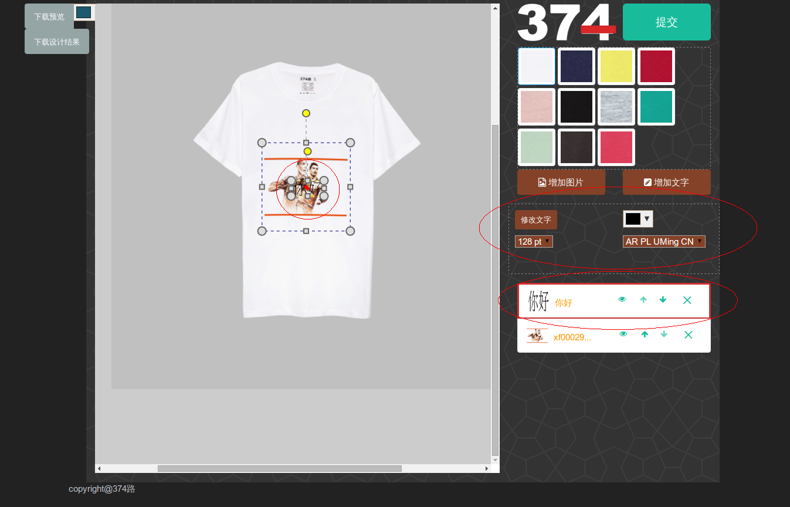

# 概述
用户点击添加文字， 会弹出一个对话框, 用户只能输入一行文字。 可以敲击回车确认输入， 或者是点击确认

# 支持浏览器

ie9+, firefox, chrome

# 检查清单
1. 点击“添加文字”， 输入文字后， 点击“确认”或者敲击回车， 查看是否添加文字成功。
2. 添加文字后，(1)选中的设计区上出现文字， (2)对象管理器上出现文字对象对应的entry。 (3) 出现一组对文字对象的操作控件。如下图所示：

