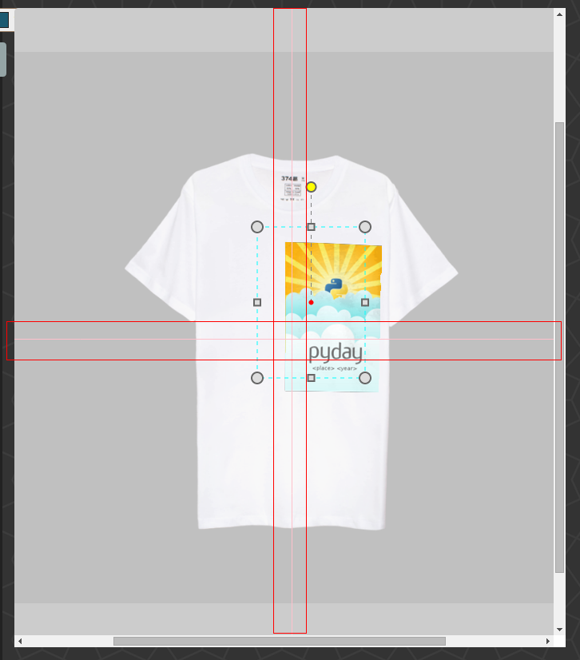

# 概述
这里的对象包含两种， 图片对象或者文字对象。 分别进行描述：

1. 图片对象， 支持如下操作:
    * 按比例缩放
    * 移动
    移动时， 支持对（衣服图片）的中心十字架的磁力吸附。如下图所示(中心十字架被圈起来):

    

    * 旋转
    * 隐藏
    * 移动到其它对象的上方或者下方
    * 删除
2. 文字对象， 支持如下操作:
    * [us4.用户修改文字对象](us4.用户修改文字对象.md)中规定的操作
    * 移动
    * 旋转
    * 隐藏
    * 移动到其它对象的上方或者下方
    * 删除

需要注意的是， 在定制区以外的部分会被隐藏。

# 适配浏览器

ie9+, firefox, chrome

# 检查清单
1. 移动图片/文字对象，是否有中心十字架出现。是否有磁力吸附效果。
2. 对图片对象执行其它操作， 查看是否有对应的变化。
3. 对文字对象执行其它操作， 查看是否有对应的变化。
4. 对于在定制区以外的部分， 是否隐藏。
5. 是否能够隐藏对象。
6. 摆放多个对象， 在对象指示器上， 对对象通过箭头进行上移下移操作。对象是否会移动到上层或者下层
7. 摆放多个对象, 拖动对象指示器， 进行上移下移， 对象是否会移动到上层或者下层。
8. 鼠标挪动到未激活状态的对象上， 是否会显示控制框。
9. 点击对象， 是否可以激活对象。
10. 点击对象指示器， 是否可以激活对象。
11. 对对象进行缩放， 旋转后进行缩放， 查看是否可以按比例进行缩放。
12. 隐藏的对象， 不能通过拖动对象指示器， 进行上移下移
